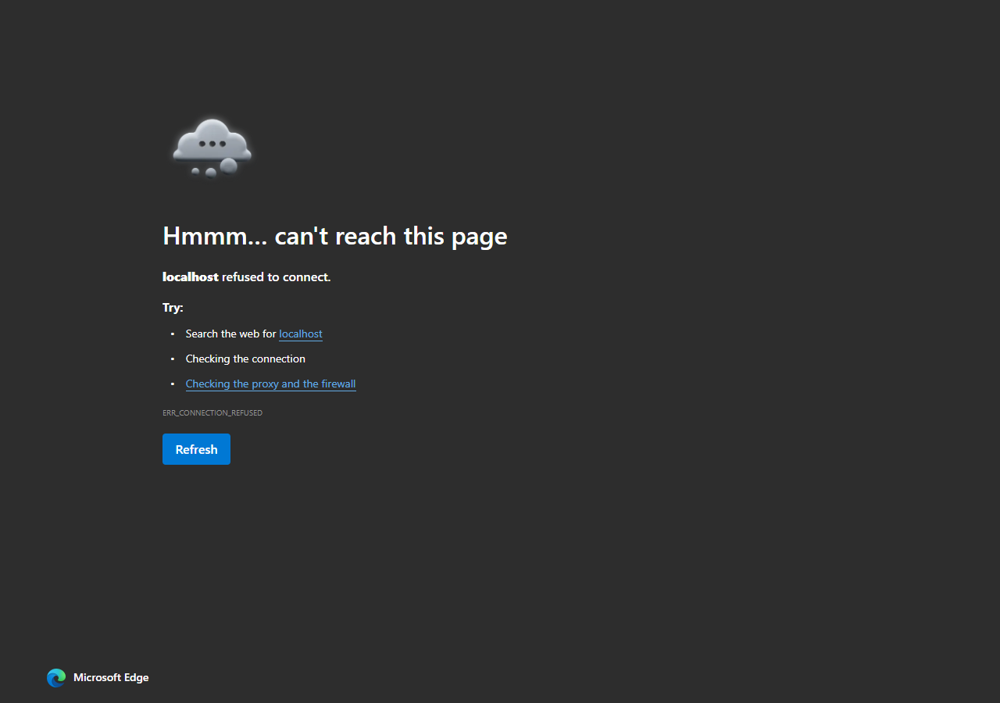
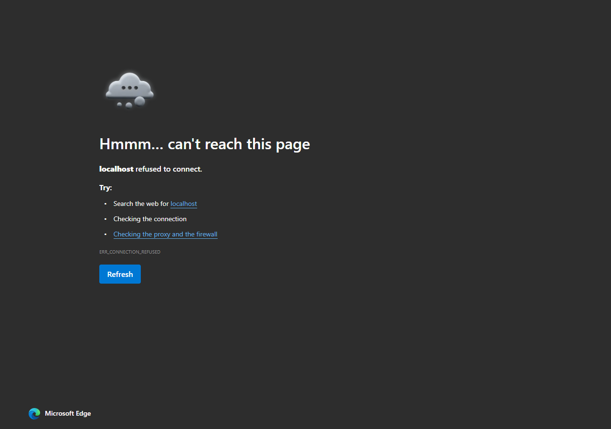
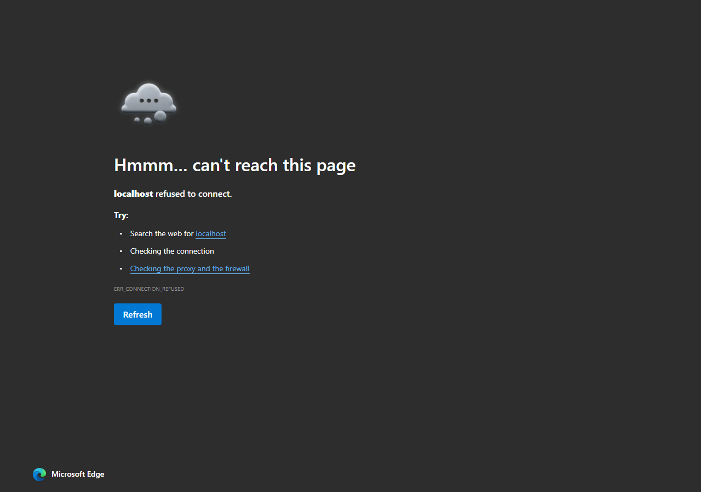
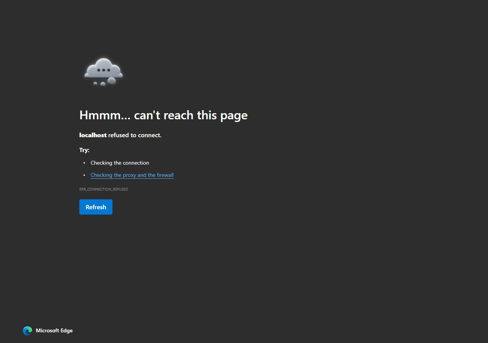

# FloodGuard — Himalayan & Hill Region Disaster Management Platform

**FloodGuard** is an integrated Flash Flood, Landslide, InSAR, Avalanche, Weather Risk Monitoring, Emergency Rescue, First Aid Request, and Digital Disaster Training platform designed for hilly and Himalayan regions of India (Uttarakhand, Himachal Pradesh, Sikkim, Assam, Jammu & Kashmir, Ladakh, Arunachal Pradesh, Meghalaya, Nagaland, Manipur, Mizoram, Tripura).

The platform serves **Citizens**, **Rescue Taskforce Teams**, **Government Officials (CWC / NDMA)**, and **System Administrators**.

---

## 📸 Real Website Live Screenshots (Captured from Localhost)

### 1. Hilly Area Disaster Risk & Flash Flood Dashboard (`/hill-dashboard`)


### 2. Soil Saturation Gauge, Configurable Bands & Trend Chart (`/soil-saturation`)


### 3. Multi-Layer GIS Hazard Map & Regional Inspector (`/hazard-map`)


### 4. AI-Based Landslide Early Warning Engine (`/landslide`)


### 5. AI Weather Telemetry & Explainable Flash Flood Forecasting (`/weather`)


### 6. Emergency First Aid SOS Request Form & GPS Locator (`/first-aid-sos`)


### 7. Rescue Taskforce Console & Priority Dispatch Queue (`/rescue-console`)


### 8. Digital Disaster Training Portal & Educational Library (`/training`)


---

## 🚀 Quick Start & Local Access

- **Frontend Application**: `http://localhost:3000`
- **Backend API & WebSockets**: `http://localhost:5000`
- **GitHub Repository**: [https://github.com/gaurisakhale/FloodResQ](https://github.com/gaurisakhale/FloodResQ)

```bash
# 1. Install dependencies for Client & Server
cd client && npm install
cd ../server && npm install
cd ..

# 2. Run Backend Server (Terminal 1)
npm run dev:server

# 3. Run Frontend Application (Terminal 2)
npm run dev:client
```

---

## 🔑 Prototype Authentication Credentials

> [!IMPORTANT]
> **Prototype Credentials**:
> - **Username**: `Flash Flood`
> - **Password**: `123456789`
> - **Error Message on Failure**: `"Access Denied. Invalid username or password."`

Centralized authentication (`server/src/routes/auth.ts` & `client/src/pages/Login.tsx`) enforces security without scattering credentials across frontend components. Public citizens can view risk maps, access safety training, submit emergency First Aid SOS requests, and track SOS status **without administrative login or exposing citizen PII**.

---

## 📊 Core Disaster Management Modules

### 1. Hilly Area Disaster Risk Dashboard (`/hill-dashboard`)
Monitors 8 core risk metrics: Flash Flood, Landslide, Avalanche, Rainfall, Soil Saturation, Weather, River/Stream, and Overall Regional Risk across 12 Hill States/UTs using standardized textual levels (**LOW**, **MODERATE**, **HIGH**, **VERY HIGH**, **CRITICAL**) alongside visual indicators.

### 2. Soil Saturation Monitoring (`/soil-saturation`)
Real-time soil saturation %, estimated water retention, slope risk, landslide correlation, configurable regional saturation bands (0–30% LOW to 86–100% CRITICAL), 24-hour Recharts history line chart, and critical warning alerts.

### 3. InSAR-Based Landslide Monitoring (`/insar`)
Tracks Synthetic Aperture Radar (Sentinel-1 / NISAR) ground displacement velocity (mm/year) across unstable slopes. Features an interactive Leaflet slope map and swappable satellite API adapter.

### 4. AI-Based Landslide Early Warning (`/landslide`)
Multi-factor early warning combining soil saturation, rainfall intensity, 7-day cumulative rainfall, ground displacement, slope angle, soil geology, elevation, temperature, and historical landslide records into a **0–100 Landslide Risk Score** with explicit contributing factors.

### 5. Avalanche Monitoring Radar (`/avalanche`)
Alpine snowpack accumulation, temperature, wind velocity/direction, 24h snowfall, snowpack stability layers, and **EXTREME** risk indicators.

### 6. AI + Weather Forecasting (`/weather`)
Live weather telemetry, 3h–24h rainfall forecasts, thunderstorm probability, extreme rainfall warnings, and explainable flash flood risk score.

### 7. Multi-Layer GIS Hazard Map (`/hazard-map`)
Interactive Leaflet GIS map with **13 toggleable hazard layers** (Flash Flood, Landslide, Soil Saturation, InSAR Movement, Avalanche, Rainfall, Rivers, Rescue Centers, Shelters, Hospitals, First Aid Points, Safe Zones, Evacuation Routes) and regional risk inspector modal.

### 8. Emergency First Aid SOS & Satellite Comms Adapter (`/first-aid-sos`)
Citizen emergency First Aid request form with **"Use My Current Location"** GPS locator, headcount, injury details, **Haversine nearest rescue branch distance calculation**, and offline `localStorage` fallback. Features honest SatCom feedback (*"SOS recorded successfully. Satellite transmission is not configured in this deployment."*).

### 9. SOS Tracker (`/sos-tracker`)
Public status tracking view allowing citizens to enter their Request ID to view live operational progress (`NEW` → `ACKNOWLEDGED` → `TEAM_ASSIGNED` → `DISPATCHED` → `EN_ROUTE` → `REACHED_LOCATION` → `ASSISTANCE_PROVIDED` → `CLOSED`).

### 10. Rescue Console (`/rescue-console`) & First Aid Management (`/first-aid-management`)
Priority-sorted dispatch queue, 8-stage operational workflow, live comms log, and internal branch stock inventory tracking.

### 11. Digital Disaster Training (`/training` & `/training-admin`)
Government-verified educational videos categorized by hill safety protocols, filter controls, video player modal, and admin resource curation.

### 12. Multi-Language Support (i18n) (`client/src/utils/i18n.ts`)
Supports 16+ Indian regional and Himalayan languages (English, Hindi, Nepali, Bengali, Assamese, Gujarati, Kannada, Malayalam, Marathi, Odia, Punjabi, Tamil, Telugu, Urdu, Manipuri, Mizo) with local preference saving.

### 13. Government Dashboard (`/government-dashboard`), Admin Console (`/admin`), & Diagnostics (`/integration-status`)
Executive multi-state operational dashboard, CWC per-river threshold registry management, emergency manual broadcast override, and real-time external adapter integration diagnostics.

---

## ⚙️ Modular Backend Integration Adapters

| Adapter / Service | File Path | Status / Config Variable |
| :--- | :--- | :--- |
| **EmergencyCommsService** | `server/src/services/emergencyCommsService.ts` | `SATELLITE_SOS_API_KEY`, `MSG91_API_KEY` |
| **WeatherService** | `server/src/services/weatherForecastService.ts` | `OPENWEATHER_API_KEY` |
| **InSARService** | `server/src/services/inSARService.ts` | `INSAR_API_KEY` |
| **AvalancheService** | `server/src/services/avalancheService.ts` | `AVALANCHE_RADAR_ENDPOINT` |
| **RescueCenterService** | `server/src/services/rescueCenterService.ts` | Internal Haversine Engine |

---

## 📐 Extended Risk Score Formula

The **Flash Flood Risk Score** ($0.0$ to $1.0$) is calculated as:

$$\text{RiskScore} = 0.30 \cdot F_{\text{rain}} + 0.25 \cdot F_{\text{rise}} + 0.15 \cdot F_{\text{level}} + 0.15 \cdot F_{\text{threshold}} + 0.08 \cdot F_{\text{soil}} + 0.07 \cdot F_{\text{dem}}$$

- $F_{\text{rain}} = \min(1.0, R / 70.0)$
- $F_{\text{rise}} = \min(1.0, W_{\text{rate}} / 2.0)$
- $F_{\text{level}} = \min(1.0, W_{\text{current}} / W_{\text{danger}})$
- $F_{\text{threshold}} = \text{CWC Warning/Danger/Extreme Breach Ratio}$
- $F_{\text{soil}} = S / 100.0$
- $F_{\text{dem}} = \min(1.0, (G / 45.0) \cdot V_n)$

---

## 📜 License & Operational Disclaimer

This platform supports disaster awareness and emergency coordination. AI-generated or model-based risk estimates are advisory and should not replace official warnings from government disaster-management (NDMA/SDMA), meteorological (IMD), geological (GSI), or emergency-response authorities. In an emergency, follow instructions issued by authorized local agencies.